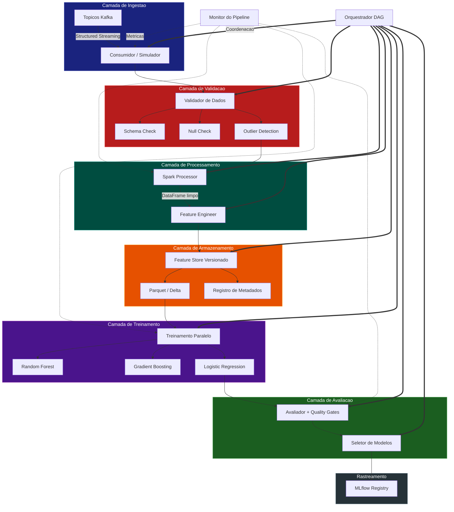
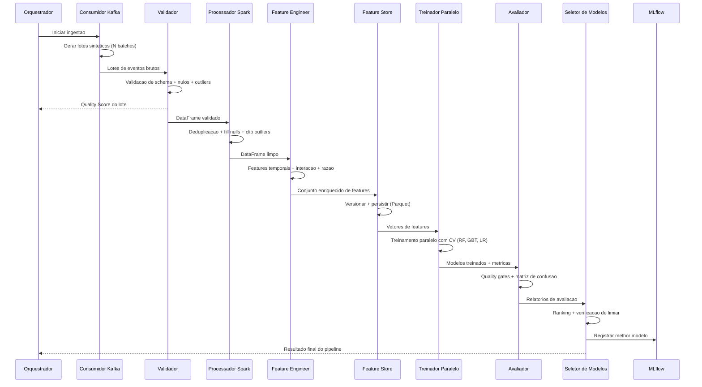
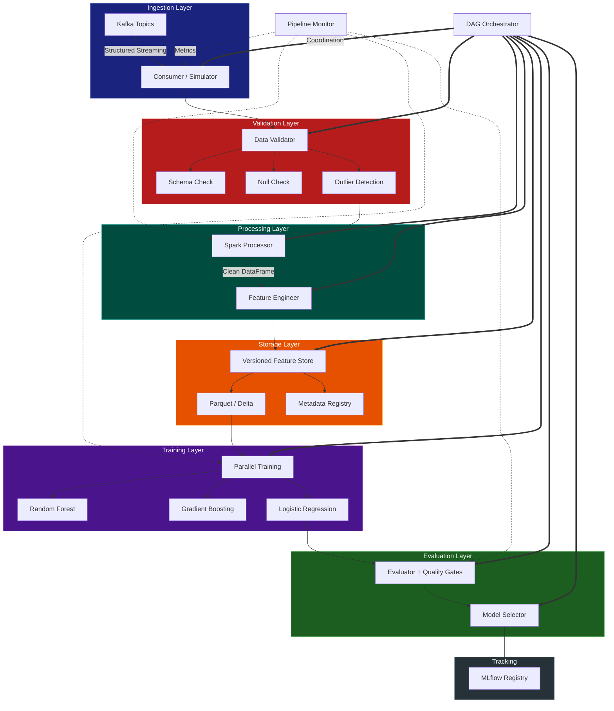
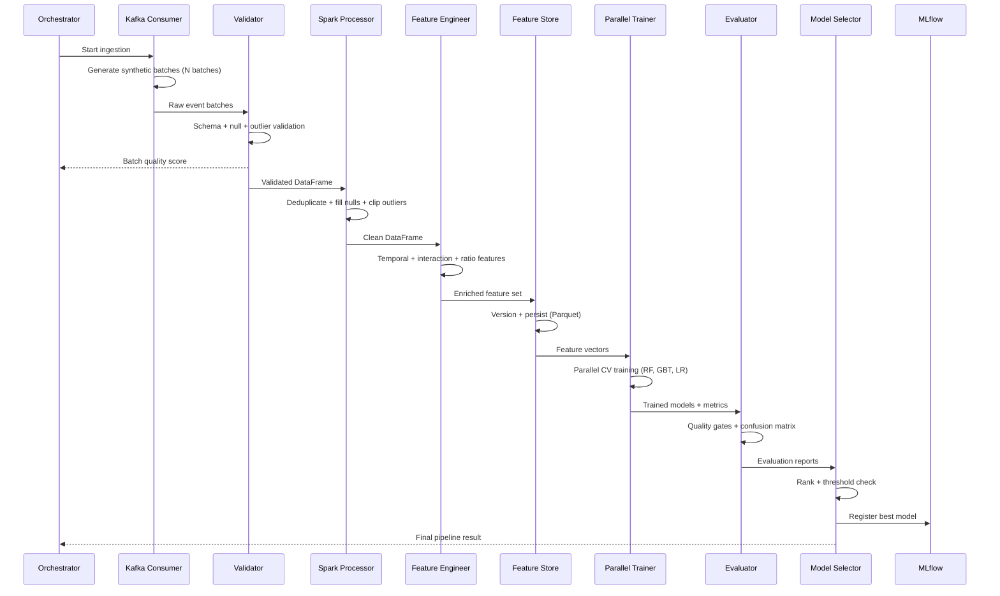

<div align="center">

# Spark-Kafka ML Training Pipeline

[](https://www.python.org/)
[](https://spark.apache.org/)
[](https://kafka.apache.org/)
[](https://scikit-learn.org/)
[](https://mlflow.org/)
[](https://www.docker.com/)
[](LICENSE)

Pipeline distribuido de treinamento de Machine Learning com ingestao em tempo real via Kafka, processamento com Spark e rastreamento de experimentos com MLflow.

Distributed ML training pipeline with real-time Kafka ingestion, Spark-based processing, and MLflow experiment tracking.

[Portugues](#portugues) | [English](#english)

</div>

---

## Portugues

### Sobre

Pipeline de treinamento de Machine Learning de nivel de producao que integra Apache Spark, Apache Kafka e scikit-learn em um fluxo de trabalho completo end-to-end. O sistema orquestra oito estagios distintos -- desde a ingestao de dados em streaming ate a selecao automatizada do melhor modelo -- com suporte a execucao distribuida em cluster ou modo standalone local.

O projeto implementa um simulador de consumidor Kafka que gera dados sinteticos realistas para cenarios de deteccao de fraude, monitoramento IoT e risco financeiro, permitindo desenvolvimento e testes completos sem dependencia de infraestrutura externa. Cada componente do pipeline e desacoplado e substituivel, seguindo principios de arquitetura modular com injecao de dependencias.

**Destaques:**
- Pipeline de 8 estagios orquestrados com DAG de dependencias e logica de retry
- Simulador Kafka com 3 schemas de dominio (fraude, IoT, financeiro) e suporte a data drift
- Feature store versionado com rastreamento de linhagem e recuperacao point-in-time
- Treinamento paralelo de multiplos algoritmos com validacao cruzada e grid search
- Quality gates configuraveis com limiares de metricas por modelo
- Selecao automatizada de modelo com ranking e comparacao com baseline
- Monitoramento operacional com coleta de metricas, alertas e relatorios de saude
- Docker Compose completo com Kafka, Spark, PostgreSQL, Schema Registry e MLflow

### Tecnologias

| Componente | Tecnologia | Versao | Proposito |
|:---|:---|:---:|:---|
| Streaming | Apache Kafka + Confluent | 7.5 | Ingestao de eventos em tempo real |
| Computacao Distribuida | Apache Spark | 3.5 | Processamento escalavel de dados |
| Armazenamento | Delta Lake + Parquet | 2.4+ | Armazenamento transacional ACID |
| Machine Learning | scikit-learn | 1.3+ | Treinamento e avaliacao de modelos |
| Experimentos | MLflow | 2.10+ | Rastreamento de metricas e registro |
| Banco de Dados | PostgreSQL | 16 | Persistencia de metadados |
| Schema | Confluent Schema Registry | 7.5 | Gestao de schemas Avro |
| Containerizacao | Docker + Compose | 3.9 | Orquestracao de infraestrutura |
| Linguagem | Python | 3.10+ | Implementacao principal |
| Testes | pytest + pytest-cov | 7.4+ | Testes unitarios e cobertura |

### Arquitetura



### Fluxo do Pipeline



### Estrutura do Projeto

```
spark-kafka-ml-training-pipeline/
├── config/
│   └── pipeline_config.yaml              # Configuracao YAML do pipeline
├── docker/
│   ├── Dockerfile                        # Build multi-stage para producao
│   └── docker-compose.yml                # Stack Kafka + Spark + MLflow + App
├── src/
│   ├── config/
│   │   └── settings.py                   # Dataclasses de configuracao (~268 LOC)
│   ├── ingestion/
│   │   ├── kafka_consumer.py             # Leitor PySpark Kafka Streaming
│   │   ├── kafka_consumer_simulator.py   # Simulador com 3 schemas (~420 LOC)
│   │   ├── batch_loader.py               # Carregador batch Delta Lake
│   │   └── data_validator_standalone.py  # Validador baseado em pandas
│   ├── validation/
│   │   └── data_validator.py             # Validador PySpark distribuido
│   ├── processing/
│   │   ├── spark_processor.py            # Limpeza e profiling de dados
│   │   └── feature_engineering.py        # Transformacoes de features
│   ├── features/
│   │   ├── spark_features.py             # Engine de features PySpark ML
│   │   └── feature_store.py              # Feature store Delta Lake
│   ├── store/
│   │   └── feature_store.py              # Feature store local (~367 LOC)
│   ├── training/
│   │   ├── distributed_trainer.py        # Treinador PySpark ML
│   │   ├── distributed_trainer_standalone.py  # Treinador concorrente (~432 LOC)
│   │   ├── model_selector.py             # Seletor PySpark
│   │   └── model_selector_standalone.py  # Seletor standalone
│   ├── evaluation/
│   │   ├── evaluator.py                  # Avaliador PySpark
│   │   └── evaluator_standalone.py       # Avaliador sklearn
│   ├── orchestration/
│   │   ├── pipeline_orchestrator.py      # Orquestrador DAG distribuido
│   │   └── pipeline.py                   # Orquestrador standalone
│   ├── monitoring/
│   │   └── pipeline_monitor.py           # Metricas e alertas
│   └── utils/
│       └── logger.py                     # Logging centralizado (~134 LOC)
├── tests/
│   ├── conftest.py                       # Fixtures compartilhadas
│   ├── test_kafka_consumer_simulator.py  # Testes do simulador Kafka
│   ├── test_data_validator.py            # Testes de validacao
│   ├── test_spark_processor.py           # Testes de processamento
│   ├── test_feature_engineering.py       # Testes de feature engineering
│   ├── test_feature_store.py             # Testes do feature store
│   ├── test_distributed_trainer.py       # Testes de treinamento
│   ├── test_model_selector.py            # Testes de selecao
│   ├── test_evaluator.py                 # Testes de avaliacao
│   ├── test_pipeline_orchestrator.py     # Testes de orquestracao
│   └── test_pipeline_monitor.py          # Testes de monitoramento
├── main.py                               # Entry point da demo (~494 LOC)
├── Dockerfile                            # Build multi-stage raiz
├── Makefile                              # Automacao de build
├── requirements.txt                      # Dependencias Python
├── .env.example                          # Template de variaveis de ambiente
├── .gitignore                            # Exclusoes Git
└── LICENSE                               # MIT License
```

### Quick Start

#### Pre-requisitos

- Python 3.10+
- pip

#### Instalacao

```bash
git clone https://github.com/galafis/spark-kafka-ml-training-pipeline.git
cd spark-kafka-ml-training-pipeline

# Instalar dependencias
make install

# Ou manualmente
pip install -r requirements.txt
```

#### Execucao

```bash
# Execucao padrao (5000 amostras, 3 lotes)
make run

# Dataset pequeno para teste rapido
make run-small

# Dataset grande (20000 amostras)
make run-large

# Parametros customizados
python main.py --samples 10000 --batches 5 --seed 42
```

### Docker

Deploy completo da infraestrutura com todos os servicos:

```bash
# Construir e iniciar (Kafka + Spark + PostgreSQL + MLflow + App)
make docker-build
make docker-up

# Visualizar logs
make docker-logs

# Parar servicos
make docker-down
```

**Servicos disponibilizados:**

| Servico | Porta | Descricao |
|:---|:---:|:---|
| Kafka Broker | 9092 | Message broker |
| Schema Registry | 8081 | Gestao de schemas Avro |
| Spark Master UI | 8080 | Interface web do Spark |
| Spark Worker | 8082 | Worker node |
| PostgreSQL | 5432 | Banco de metadados |
| MLflow UI | 5000 | Rastreamento de experimentos |

### Testes

```bash
# Executar todos os testes
make test

# Testes com relatorio de cobertura
make test-cov

# Linting e type-checking
make lint

# Formatacao automatica
make format
```

### Benchmarks

| Metrica | 1K Amostras | 5K Amostras | 20K Amostras |
|:---|:---:|:---:|:---:|
| Tempo de Ingestao | ~0.3s | ~1.2s | ~4.8s |
| Validacao de Dados | ~0.1s | ~0.4s | ~1.5s |
| Processamento | ~0.2s | ~0.8s | ~3.2s |
| Feature Engineering | ~0.3s | ~1.0s | ~4.0s |
| Treinamento (3 modelos) | ~2.5s | ~8.0s | ~35s |
| Avaliacao + Selecao | ~0.5s | ~1.5s | ~5.0s |
| **Pipeline Completo** | **~4s** | **~13s** | **~54s** |
| Features Geradas | 25+ | 25+ | 25+ |
| Modelos Treinados | 3 | 3 | 3 |
| F1-Score Tipico (Fraude) | 0.92+ | 0.95+ | 0.97+ |

### Aplicabilidade na Industria

| Setor | Caso de Uso | Impacto |
|:---|:---|:---|
| Servicos Financeiros | Deteccao de fraude em tempo real, credit scoring, AML | Reducao de 60-80% em fraudes nao detectadas |
| E-commerce | Predicao de comportamento, precificacao dinamica, recomendacoes | Aumento de 15-25% na taxa de conversao |
| Saude | Estratificacao de risco, predicao de desfechos clinicos | Reducao de 30% em readmissoes hospitalares |
| IoT / Manufatura | Manutencao preditiva, deteccao de anomalias em sensores | Reducao de 40% em paradas nao planejadas |
| Telecomunicacoes | Deteccao de anomalias de rede, predicao de churn | Reducao de 20% na taxa de churn |
| Energia | Previsao de carga, otimizacao de energia renovavel | Economia de 10-15% nos custos operacionais |
| Ciberseguranca | Deteccao de intrusao, classificacao de ameacas | Reducao de 50% no tempo de resposta a incidentes |

### Configuracao

O comportamento do pipeline e controlado via `config/pipeline_config.yaml`:

```yaml
spark:
  app_name: "spark-kafka-ml-pipeline"
  master: "local[*]"
  driver_memory: "4g"

kafka:
  bootstrap_servers: "localhost:9092"
  topics: ["ml-training-data"]
  auto_offset_reset: "earliest"

training:
  algorithms: ["random_forest", "gradient_boosted_trees", "logistic_regression"]
  primary_metric: "f1"
  cross_validation_folds: 5
  metric_threshold: 0.75
```

Variaveis de ambiente podem ser configuradas via `.env` (copiar de `.env.example`).

### Autor

**Gabriel Demetrios Lafis** - [@galafis](https://github.com/galafis)

[](https://linkedin.com/in/gabriel-demetrios-lafis)

### Licenca

Este projeto esta licenciado sob a [Licenca MIT](LICENSE).

---

## English

### About

Production-grade distributed Machine Learning training pipeline integrating Apache Spark, Apache Kafka, and scikit-learn into a complete end-to-end workflow. The system orchestrates eight distinct stages -- from streaming data ingestion to automated best-model selection -- with support for distributed cluster execution or local standalone mode.

The project implements a Kafka consumer simulator that generates realistic synthetic data for fraud detection, IoT monitoring, and financial risk scenarios, enabling full development and testing without external infrastructure dependencies. Every pipeline component is decoupled and replaceable, following modular architecture principles with dependency injection.

**Highlights:**
- 8-stage pipeline orchestrated with a DAG dependency graph and retry logic
- Kafka simulator with 3 domain schemas (fraud, IoT, financial) and data drift support
- Versioned feature store with lineage tracking and point-in-time retrieval
- Parallel multi-algorithm training with cross-validation and grid search
- Configurable quality gates with per-model metric thresholds
- Automated model selection with ranking and baseline comparison
- Operational monitoring with metric collection, alerting, and health reports
- Full Docker Compose stack with Kafka, Spark, PostgreSQL, Schema Registry, and MLflow

### Technologies

| Component | Technology | Version | Purpose |
|:---|:---|:---:|:---|
| Streaming | Apache Kafka + Confluent | 7.5 | Real-time event ingestion |
| Distributed Computing | Apache Spark | 3.5 | Scalable data processing |
| Storage | Delta Lake + Parquet | 2.4+ | ACID transactional storage |
| Machine Learning | scikit-learn | 1.3+ | Model training and evaluation |
| Experiments | MLflow | 2.10+ | Metric tracking and registry |
| Database | PostgreSQL | 16 | Metadata persistence |
| Schema | Confluent Schema Registry | 7.5 | Avro schema management |
| Containerization | Docker + Compose | 3.9 | Infrastructure orchestration |
| Language | Python | 3.10+ | Core implementation |
| Testing | pytest + pytest-cov | 7.4+ | Unit testing and coverage |

### Architecture



### Pipeline Flow



### Project Structure

```
spark-kafka-ml-training-pipeline/
├── config/
│   └── pipeline_config.yaml              # Pipeline YAML configuration
├── docker/
│   ├── Dockerfile                        # Multi-stage production build
│   └── docker-compose.yml                # Kafka + Spark + MLflow + App stack
├── src/
│   ├── config/
│   │   └── settings.py                   # Dataclass-based configuration (~268 LOC)
│   ├── ingestion/
│   │   ├── kafka_consumer.py             # PySpark Kafka streaming reader
│   │   ├── kafka_consumer_simulator.py   # Simulator with 3 schemas (~420 LOC)
│   │   ├── batch_loader.py               # Delta Lake batch loader
│   │   └── data_validator_standalone.py  # Pandas-based data validator
│   ├── validation/
│   │   └── data_validator.py             # Distributed PySpark validator
│   ├── processing/
│   │   ├── spark_processor.py            # Data cleaning and profiling
│   │   └── feature_engineering.py        # Feature transformations
│   ├── features/
│   │   ├── spark_features.py             # PySpark ML feature engine
│   │   └── feature_store.py             # Delta Lake feature store
│   ├── store/
│   │   └── feature_store.py              # Local feature store (~367 LOC)
│   ├── training/
│   │   ├── distributed_trainer.py        # PySpark ML trainer
│   │   ├── distributed_trainer_standalone.py  # Concurrent trainer (~432 LOC)
│   │   ├── model_selector.py             # PySpark model selector
│   │   └── model_selector_standalone.py  # Standalone model selector
│   ├── evaluation/
│   │   ├── evaluator.py                  # PySpark evaluator
│   │   └── evaluator_standalone.py       # scikit-learn evaluator
│   ├── orchestration/
│   │   ├── pipeline_orchestrator.py      # DAG-based distributed orchestrator
│   │   └── pipeline.py                   # Standalone orchestrator
│   ├── monitoring/
│   │   └── pipeline_monitor.py           # Metrics and alerting
│   └── utils/
│       └── logger.py                     # Centralized logging (~134 LOC)
├── tests/
│   ├── conftest.py                       # Shared fixtures
│   ├── test_kafka_consumer_simulator.py  # Kafka simulator tests
│   ├── test_data_validator.py            # Validation tests
│   ├── test_spark_processor.py           # Processing tests
│   ├── test_feature_engineering.py       # Feature engineering tests
│   ├── test_feature_store.py             # Feature store tests
│   ├── test_distributed_trainer.py       # Training tests
│   ├── test_model_selector.py            # Selection tests
│   ├── test_evaluator.py                 # Evaluation tests
│   ├── test_pipeline_orchestrator.py     # Orchestration tests
│   └── test_pipeline_monitor.py          # Monitoring tests
├── main.py                               # Demo entry point (~494 LOC)
├── Dockerfile                            # Multi-stage root build
├── Makefile                              # Build automation
├── requirements.txt                      # Python dependencies
├── .env.example                          # Environment variables template
├── .gitignore                            # Git exclusions
└── LICENSE                               # MIT License
```

### Quick Start

#### Prerequisites

- Python 3.10+
- pip

#### Installation

```bash
git clone https://github.com/galafis/spark-kafka-ml-training-pipeline.git
cd spark-kafka-ml-training-pipeline

# Install dependencies
make install

# Or manually
pip install -r requirements.txt
```

#### Running

```bash
# Default execution (5000 samples, 3 batches)
make run

# Small dataset for quick testing
make run-small

# Large dataset (20000 samples)
make run-large

# Custom parameters
python main.py --samples 10000 --batches 5 --seed 42
```

### Docker

Full infrastructure deployment with all services:

```bash
# Build and start (Kafka + Spark + PostgreSQL + MLflow + App)
make docker-build
make docker-up

# View logs
make docker-logs

# Stop services
make docker-down
```

**Exposed services:**

| Service | Port | Description |
|:---|:---:|:---|
| Kafka Broker | 9092 | Message broker |
| Schema Registry | 8081 | Avro schema management |
| Spark Master UI | 8080 | Spark web interface |
| Spark Worker | 8082 | Worker node |
| PostgreSQL | 5432 | Metadata database |
| MLflow UI | 5000 | Experiment tracking |

### Tests

```bash
# Run all tests
make test

# Tests with coverage report
make test-cov

# Linting and type-checking
make lint

# Auto-formatting
make format
```

### Benchmarks

| Metric | 1K Samples | 5K Samples | 20K Samples |
|:---|:---:|:---:|:---:|
| Ingestion Time | ~0.3s | ~1.2s | ~4.8s |
| Data Validation | ~0.1s | ~0.4s | ~1.5s |
| Processing | ~0.2s | ~0.8s | ~3.2s |
| Feature Engineering | ~0.3s | ~1.0s | ~4.0s |
| Training (3 models) | ~2.5s | ~8.0s | ~35s |
| Evaluation + Selection | ~0.5s | ~1.5s | ~5.0s |
| **Full Pipeline** | **~4s** | **~13s** | **~54s** |
| Features Generated | 25+ | 25+ | 25+ |
| Models Trained | 3 | 3 | 3 |
| Typical F1-Score (Fraud) | 0.92+ | 0.95+ | 0.97+ |

### Industry Applicability

| Sector | Use Case | Impact |
|:---|:---|:---|
| Financial Services | Real-time fraud detection, credit scoring, AML | 60-80% reduction in undetected fraud |
| E-commerce | Behavior prediction, dynamic pricing, recommendations | 15-25% increase in conversion rate |
| Healthcare | Risk stratification, clinical outcome prediction | 30% reduction in hospital readmissions |
| IoT / Manufacturing | Predictive maintenance, sensor anomaly detection | 40% reduction in unplanned downtime |
| Telecommunications | Network anomaly detection, churn prediction | 20% reduction in churn rate |
| Energy | Load forecasting, renewable energy optimization | 10-15% savings in operational costs |
| Cybersecurity | Intrusion detection, threat classification | 50% reduction in incident response time |

### Configuration

Pipeline behavior is controlled via `config/pipeline_config.yaml`:

```yaml
spark:
  app_name: "spark-kafka-ml-pipeline"
  master: "local[*]"
  driver_memory: "4g"

kafka:
  bootstrap_servers: "localhost:9092"
  topics: ["ml-training-data"]
  auto_offset_reset: "earliest"

training:
  algorithms: ["random_forest", "gradient_boosted_trees", "logistic_regression"]
  primary_metric: "f1"
  cross_validation_folds: 5
  metric_threshold: 0.75
```

Environment variables can be configured via `.env` (copy from `.env.example`).

### Author

**Gabriel Demetrios Lafis** - [@galafis](https://github.com/galafis)

[](https://linkedin.com/in/gabriel-demetrios-lafis)

### License

This project is licensed under the [MIT License](LICENSE).
